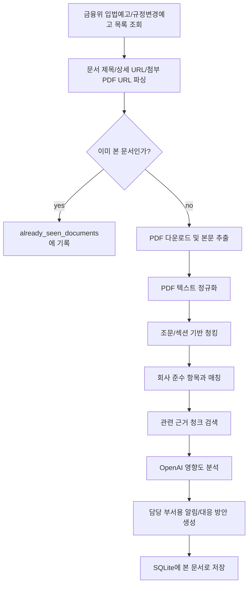

# 금융 규제 및 법규준수 모니터링 AI 에이전트

금융위원회 입법예고/규정변경예고 문서를 모니터링하고, 전자금융/IT보안 관점에서 회사 준수 항목에 미치는 영향을 분석하는 FastAPI 데모입니다.

6일 안에 면접에서 설명 가능한 수준의 MVP를 만드는 것을 목표로 했습니다. 실시간 알림 발송이나 대규모 벡터DB 구축보다, 공식 문서 수집 -> PDF 본문 추출 -> 근거 청크 검색 -> 준수 항목 대조 -> OpenAI 기반 요약/대응안 생성 흐름을 실제로 작동시키는 데 집중했습니다.

## 주요 기능

- 금융위원회 `입법예고/규정변경예고` 목록 조회
- 전자금융/IT보안/신용정보 관련 규제 후보 필터링
- PDF 첨부파일 다운로드 및 본문 텍스트 추출
- 법률 문서 구조를 고려한 조문/섹션 기반 청킹
- 회사 샘플 준수 항목과 규제 문서의 키워드 기반 매칭
- 검색된 근거 청크를 OpenAI 분석 프롬프트에 함께 전달
- 영향도, 담당 부서, 대응 방안, 알림 메시지 생성
- SQLite 기반 중복 감지로 이미 본 문서는 기본 실행에서 제외
- OpenAI API 실패 시 규칙 기반 분석으로 fallback

## 전체 흐름



## 프로젝트 구조

```text
finance_agent/
├── app/
│   ├── api/
│   │   └── routes.py                  # FastAPI monitor API 라우터
│   ├── core/
│   │   └── config.py                  # 환경변수 및 설정
│   ├── data/
│   │   └── company_controls.json      # 샘플 회사 준수 항목
│   ├── prompts/
│   │   └── impact_analysis.md         # OpenAI 영향도 분석 프롬프트
│   ├── schemas/
│   │   ├── analysis.py                # API 응답/분석 결과 스키마
│   │   ├── chunk.py                   # 규제 청크/근거 청크 스키마
│   │   ├── compliance.py              # 회사 준수 항목 스키마
│   │   └── regulation.py              # 규제 문서 스키마
│   ├── services/
│   │   ├── fsc_client.py              # 금융위 목록 HTML 조회/파싱
│   │   ├── document_service.py        # PDF 다운로드/본문 추출
│   │   ├── text_normalization_service.py # 한글 PDF 텍스트 정규화
│   │   ├── chunking_service.py        # 조문/섹션 기반 청킹
│   │   ├── retrieval_service.py       # 근거 청크 검색
│   │   ├── compliance_service.py      # 준수 항목 매칭/영향 분석 오케스트레이션
│   │   ├── openai_service.py          # OpenAI JSON 분석 호출
│   │   ├── notification_service.py    # 알림 메시지 생성
│   │   └── seen_document_store.py     # SQLite 중복 감지
│   └── main.py                        # FastAPI 앱 엔트리포인트
├── docs/                              # 개발 블로그 초안
├── samples/                           # 수동 확인용 HTML/PDF 샘플
├── storage/                           # 런타임 SQLite DB 위치
├── tests/                             # pytest 테스트
├── requirements.txt
└── README.md
```

## 실행 방법

Python 가상환경을 만든 뒤 의존성을 설치합니다.

```bash
python -m venv .venv
source .venv/bin/activate
pip install -r requirements.txt
```

프로젝트 루트에 `.env` 파일을 만듭니다.

```text
OPENAI_API_KEY=your-openai-api-key
OPENAI_MODEL=gpt-4o-mini
```

서버를 실행합니다.

```bash
uvicorn app.main:app --reload
```

Swagger UI:

```text
http://127.0.0.1:8000/docs
```

## 데모 API

### 1. 모니터링 실행

```bash
curl -X POST "http://127.0.0.1:8000/monitor/run"
```

기본값은 `include_seen=false`입니다. 이미 SQLite에 저장된 문서는 다시 분석하지 않고 `already_seen_documents`에 표시합니다.

이미 본 문서까지 다시 분석하려면:

```bash
curl -X POST "http://127.0.0.1:8000/monitor/run?include_seen=true"
```

### 2. 데모용 요약 응답

```bash
curl "http://127.0.0.1:8000/monitor/summary?include_seen=true"
```

긴 JSON 대신 발표에 필요한 핵심만 보여줍니다.

- 문서 제목
- 영향도
- 담당 부서
- 판단 이유
- 권고 대응안
- 근거 조문
- 상세 URL

### 3. 상태 확인

```bash
curl "http://127.0.0.1:8000/health"
```

## 중복 감지 동작

분석이 끝난 관련 문서는 `storage/seen_documents.db`에 저장됩니다. 이후 기본 실행에서는 같은 문서를 다시 OpenAI로 분석하지 않습니다.

```text
POST /monitor/run
```

위 요청에서 이미 본 문서가 있으면:

```json
{
  "relevant_documents": [],
  "already_seen_documents": ["이미 분석한 문서 제목"]
}
```

데모 중 같은 결과를 다시 보여주고 싶다면 `include_seen=true`를 사용합니다.

## RAG를 어디까지 구현했나

이 프로젝트는 무거운 벡터DB 기반 RAG까지는 가지 않고, 6일 MVP에 맞춘 "가벼운 근거 검색형 RAG"를 구현했습니다.

- PDF 본문을 조문/섹션 단위로 청킹
- 회사 준수 항목 키워드로 관련 청크 검색
- 검색된 청크를 evidence로 OpenAI 프롬프트에 전달
- OpenAI 응답이 evidence 밖으로 과하게 확장되지 않도록 필터링

향후 고도화한다면 BM25 + 벡터 검색 + reranker 조합으로 바꿀 수 있습니다.

## 테스트

```bash
pytest
```

현재 테스트 범위:

- FastAPI 앱 import
- 금융위 목록 파싱
- PDF 텍스트 정규화
- 조문 기반 청킹
- 근거 청크 검색
- 회사 준수 항목 매칭
- OpenAI 실패 시 fallback
- 요약 API 응답
- SQLite 중복 감지

## 개발 블로그 초안

개발 과정은 `docs/`에 단계별 글로 정리했습니다.

1. [문제 정의와 MVP 범위 잡기](./docs/01-mvp-scope.md)
2. [금융위원회 사이트 모니터링과 PDF 수집](./docs/02-fsc-monitoring-and-pdf.md)
3. [PDF 본문 추출과 법률 문서 청킹](./docs/03-pdf-chunking-rag.md)
4. [준수 항목 매칭과 OpenAI 영향도 분석](./docs/04-compliance-openai-analysis.md)
5. [FastAPI 데모 실행과 회고](./docs/05-demo-retrospective.md)
6. [데모용 요약 API와 중복 감지](./docs/06-summary-and-dedup.md)

## 면접에서 설명할 포인트

- 사용자가 PDF를 업로드하는 도구가 아니라, 에이전트가 공식 출처를 직접 확인하는 구조로 설계했다.
- 크롤링 대상은 HTML 목록이고, 실제 규제 변경 근거는 PDF 본문에서 추출했다.
- 법률 문서는 고정 길이 청킹보다 조문/섹션 단위 청킹이 중요하다고 판단했다.
- OpenAI 결과를 그대로 쓰지 않고, 검색된 evidence와 회사 준수 항목을 기준으로 한 번 더 제한했다.
- 이미 본 문서는 SQLite에 저장해 중복 분석과 API 비용 낭비를 줄였다.
- 실시간 스케줄링과 실제 알림 발송은 설계 대상으로 남기고, MVP에서는 분석 파이프라인의 end-to-end 동작을 우선 구현했다.

## 향후 개선

- 금융감독원/금융보안원 등 모니터링 출처 확장
- APScheduler 또는 AWS EventBridge 기반 주기 실행
- Slack/Email 알림 연동
- OpenAI embeddings 또는 ChromaDB 기반 벡터 검색
- BM25 + vector hybrid search
- 근거 조문별 평가셋 구축 및 retrieval 품질 평가
