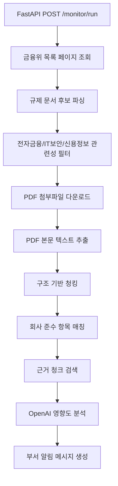

# 금융 규제 모니터링 AI 에이전트 만들기 1: 문제 정의와 MVP 범위 잡기

## 시작점

IT 인턴 지원용 데모로 `금융 규제 및 법규준수 모니터링 AI 에이전트`를 만들기로 했다. 원래 목표는 꽤 컸다.

- 금융감독원/금융위원회가 공개하는 법령·공시 데이터를 분석해 규제 변경사항을 모니터링
- 우리 회사의 규정 준수 여부를 자동 점검
- 규제 변경 시 관련 부서에 알림을 주고 필요한 대응 방안 제시

하지만 개발 기간은 6일이었다. 처음부터 실시간 크롤링, RAG, 부서 알림, AWS 배포까지 모두 구현하려고 하면 어느 하나도 제대로 설명하기 어려울 것 같았다. 그래서 MVP를 다시 잡았다.

## MVP 판단

처음에는 사용자가 PDF나 URL을 넣으면 분석하는 도구를 생각했다. 그런데 프로젝트 이름이 "모니터링 AI 에이전트"라면 사용자가 문서를 넣는 것보다, 에이전트가 먼저 공식 출처를 확인하는 편이 더 자연스럽다.

그래서 MVP를 이렇게 정했다.

```text
금융위 공식 페이지 조회
→ 최신 규제 후보 감지
→ 관련 문서 필터링
→ PDF 다운로드/본문 추출
→ 회사 준수 항목과 매칭
→ OpenAI 영향도 분석
→ 담당 부서용 알림 메시지 생성
```

실제 Slack/Email 발송이나 스케줄러는 설계로 남기고, 핵심 판단 파이프라인을 먼저 완성하는 쪽을 선택했다.

## 전체 아키텍처



## 가상 회사 설정

은행으로 가정하면 범위가 너무 넓어진다. 예금, 대출, 외환, 자본적정성 같은 주제가 끼어들 수 있기 때문이다. 그래서 데모 회사는 전자금융 서비스를 운영하는 핀테크 회사로 잡았다.

가정한 서비스:

- 간편결제
- 송금
- 선불전자지급수단
- API 연동

관심 규제:

- 전자금융거래법
- 전자금융감독규정
- 금융보안
- 사고 보고
- 이상거래탐지
- 개인정보/신용정보
- 내부통제

## 이 단계의 고민

가장 큰 고민은 "데모에서 어디까지 실제로 작동해야 하는가"였다. 크롤링, PDF 파싱, RAG, OpenAI 분석, 알림 발송을 모두 완성하려고 하면 설명 가능한 코드가 아니라 급하게 이어붙인 코드가 될 것 같았다.

그래서 핵심을 이렇게 나눴다.

```text
반드시 구현:
공식 출처 조회, PDF 수집, 본문 추출, 준수 항목 매칭, OpenAI 분석

설계로 남김:
스케줄러, 실제 부서 알림 발송, 다중 기관 확장, 고도화된 하이브리드 검색
```

이렇게 나누니 면접에서 설명할 수 있는 중심축이 생겼다.

