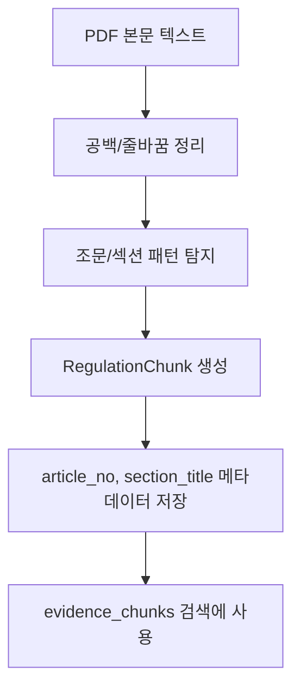

# 금융 규제 모니터링 AI 에이전트 만들기 3: PDF 본문 추출과 법률 문서 청킹

## PDF 본문을 왜 읽어야 했나

목록 페이지의 제목만으로는 "전자금융 관련 문서다" 정도는 알 수 있다. 하지만 어떤 규제가 어떻게 바뀌는지는 알 수 없다.

예를 들어 제목이 `전자금융거래법 시행령 일부개정령안`이라고 해도, 실제 영향 판단에는 다음 정보가 필요하다.

- 어떤 조문이 바뀌는지
- 적용 대상이 누구인지
- 회사 내부 절차 중 무엇이 영향을 받는지
- 담당 부서가 어떤 조치를 해야 하는지

이 정보는 대부분 첨부 PDF 안에 있다.

## pypdf로 텍스트 추출

PDF를 다운로드한 뒤 `pypdf`로 텍스트를 추출했다.

```python
reader = PdfReader(BytesIO(response.content))
page_texts = []
for page in reader.pages[:5]:
    text = page.extract_text() or ""
    if text.strip():
        page_texts.append(text.strip())
```

처음에는 모든 페이지를 다 읽을 수도 있었지만, 데모 응답 속도와 비용을 생각해 앞부분 일부를 먼저 사용했다. 금융위 개정안은 보통 초반에 제안이유와 주요내용이 들어 있어 MVP에는 충분했다.

## 왜 고정 길이 청킹을 피했나

RAG 예제를 보면 흔히 500토큰, 1000토큰 단위로 문서를 자른다. 하지만 법률 문서에서는 위험하다. 조문 하나가 중간에 잘리면 의미가 깨질 수 있기 때문이다.

예를 들어 이런 문장이 있다고 하자.

```text
제13조의11 정산대상금액의 지급방법 및 절차
전자지급결제과정에서 ...
```

이걸 고정 길이로 자르면 `제13조의11`이라는 조문 번호와 실제 내용이 다른 청크로 떨어질 수 있다. 그러면 검색된 청크가 어느 조문인지 알기 어렵다.

그래서 구조 기반 청킹을 선택했다.

```text
청킹 경계:
- 1. 제안이유
- 2. 주요내용
- 가.
- 나.
- 제13조의8
- 제62조의2
```

## 구조 기반 청킹 흐름



청크는 이런 구조를 가진다.

```json
{
  "chunk_id": "reg-chunk-038",
  "document_title": "전자금융거래법 시행령 일부개정령안",
  "source": "금융위원회",
  "published_date": "2026-06-19",
  "section_title": "제62조의2) 선불충전금 별도관리...",
  "article_no": "제62조의2",
  "text": "..."
}
```

## evidence_chunks란 무엇인가

`evidence_chunks`는 OpenAI가 영향도 분석을 할 때 참고할 근거 조문이다.

현재 응답에는 이런 근거가 붙는다.

```json
{
  "article_no": "제62조의2",
  "quote": "선불충전금 별도관리의 기준, 정산대상금액 외부관리의 기준..."
}
```

즉 OpenAI가 그냥 "영향 있음"이라고 말하는 것이 아니라, 다음과 같이 말할 근거를 갖게 된다.

```text
제62조의2에 정산대상금액 외부관리 기준이 있고,
제62조에 정산대상금액 점검 의무가 있으므로,
핀테크 회사의 내부통제/전자금융 운영 절차 검토가 필요하다.
```

## 작은 검색, 큰 문맥

이번 구현은 완전한 벡터DB RAG는 아니다. 대신 법률 문서 RAG의 핵심 아이디어를 가볍게 구현했다.

```text
1. PDF 본문을 조문/섹션 단위로 나눈다.
2. 회사 준수 항목의 키워드와 관련 있는 청크를 찾는다.
3. 찾은 청크를 evidence로 OpenAI에 전달한다.
```

향후에는 이 구조 위에 BM25, embedding, reranker를 얹을 수 있다.

## 이 단계의 고민

PDF 텍스트 추출 결과는 사람이 보는 PDF와 다르게 줄바꿈이 깨지거나 문장이 붙어서 나오는 경우가 있었다. 처음 정규식은 줄 시작에 있는 `제N조`만 잘 잡았는데, 실제 PDF에서는 `제13조의8`이 문장 중간에 붙어서 나오는 경우가 있었다.

그래서 청킹 기준을 줄 시작뿐 아니라 본문 중간의 조문 패턴도 잡도록 바꿨다.

이 과정에서 느낀 점은, 법률 문서 RAG에서 청킹은 단순 전처리가 아니라 검색 품질을 좌우하는 핵심 로직이라는 것이다.

