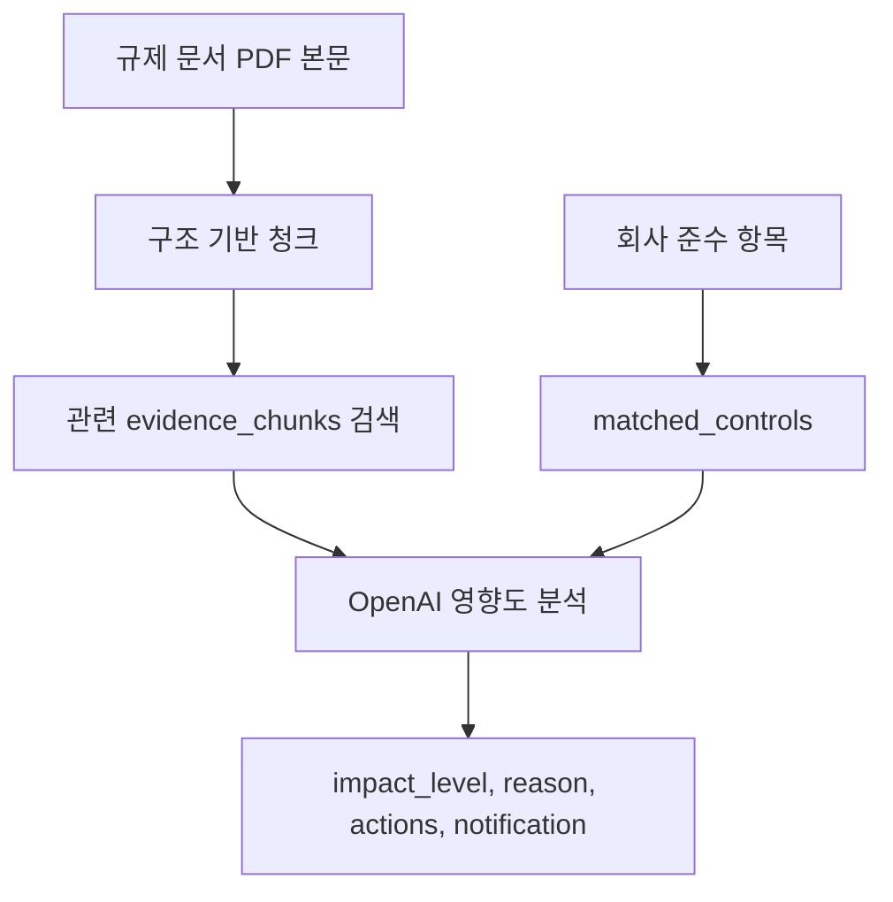

# 금융 규제 모니터링 AI 에이전트 만들기 4: 준수 항목 매칭과 OpenAI 영향도 분석

## 회사 준수 항목을 샘플로 만든 이유

실제 회사 내부 규정은 사용할 수 없기 때문에, 전자금융 서비스를 운영하는 핀테크 회사를 가정하고 샘플 준수 항목을 만들었다.

예시:

- 전자금융 사고 보고 절차
- 침해사고 대응 및 금융보안 보고 절차
- 이상거래탐지시스템 운영 기준
- 이용자 인증 및 접근권한 관리 기준
- 개인정보 암호화 및 보관/파기 기준
- 클라우드 및 외부 위탁 보안 점검 기준
- 내부통제 변경관리 절차

이 데이터는 `app/data/company_controls.json`에 저장했다.

## 매칭 방식

현재 매칭은 간단한 키워드 기반이다.

```text
규제 문서 제목 + PDF 본문
→ 회사 준수 항목의 keywords와 비교
→ 관련 준수 항목 추출
```

완전한 벡터 검색은 아니지만, MVP에서는 설명 가능성과 안정성을 우선했다. 특히 법률 문서에서는 `제62조`, `전자금융감독규정`, `정산대상금액` 같은 정확한 단어 매칭이 중요하기 때문에 키워드 검색도 의미가 있다.

## OpenAI는 어디에 쓰나

OpenAI는 최종 판단 단계에 사용한다.



OpenAI에 전달하는 정보:

- 규제 문서 제목
- PDF 본문 일부
- 관련 회사 준수 항목
- evidence_chunks
- 핀테크 회사라는 가정

OpenAI가 반환하는 정보:

```json
{
  "impact_level": "MEDIUM",
  "affected_departments": ["준법감시팀", "IT보안팀"],
  "reason": "...",
  "recommended_actions": ["..."],
  "notification_message": "..."
}
```

## JSON 응답을 강제한 이유

데모 API는 사람이 읽는 설명뿐 아니라 프로그램이 다시 사용할 수 있는 구조가 필요하다. 그래서 OpenAI 응답은 자유 텍스트가 아니라 JSON으로 받도록 했다.

```python
response_format={"type": "json_object"}
```

그리고 결과는 Pydantic 모델로 검증했다.

```python
class OpenAIImpactResult(BaseModel):
    impact_level: str
    affected_departments: list[str]
    reason: str
    recommended_actions: list[str]
    notification_message: str
```

이렇게 하면 응답 형식이 깨졌을 때 바로 fallback할 수 있다.

## fallback을 둔 이유

OpenAI API는 네트워크 오류, 키 오류, 모델 오류, JSON 파싱 오류가 날 수 있다. 데모 중 API 오류 때문에 전체 시스템이 죽으면 안 된다.

그래서 OpenAI 분석이 실패하면 기존 규칙 기반 결과를 반환하도록 했다.

```text
OpenAI 성공:
analysis_method = "openai"

OpenAI 실패:
analysis_method = "rule_based"
```

이 구조 덕분에 `.env`가 없을 때도 서버는 정상 동작한다.

## 실제 결과 예시

전자금융 문서에 대해 OpenAI는 다음처럼 분석했다.

```text
정산대상금액의 외부 관리 및 점검 절차가 강화되며,
이는 전자금융 사고 보고 절차와 내부통제 변경관리 절차에 영향을 줄 수 있다.
```

근거 청크는 다음과 같이 붙었다.

```text
제62조의2: 선불충전금 별도관리, 정산대상금액 외부관리 기준
제62조: 정산대상금액 점검 및 부족분 추가 외부관리
제13조의11: 정산대상금액 지급방법 및 절차
```

## 이 단계의 고민

OpenAI에게 PDF 본문 전체를 무작정 넘기면 비용도 커지고 근거가 흐려질 수 있다. 그래서 구조 기반 청크 중 관련도가 높은 `evidence_chunks`를 함께 넘겼다.

또 하나의 고민은 hallucination이었다. OpenAI가 검색되지 않은 조문을 단정하지 않도록 프롬프트에 다음 조건을 넣었다.

```text
근거 청크에 없는 구체적인 조문 내용은 단정하지 마라.
```

법률/규제 도메인에서는 답변의 그럴듯함보다 근거가 더 중요하다고 판단했다.

