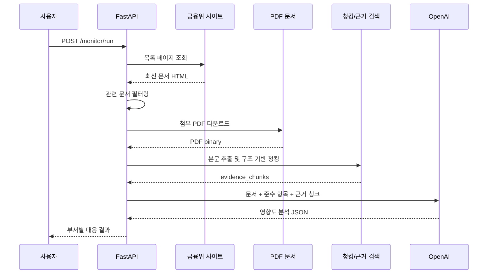

# 금융 규제 모니터링 AI 에이전트 만들기 5: FastAPI 데모 실행과 회고

## 최종 데모 흐름

현재 데모는 FastAPI 기반으로 동작한다.

핵심 API:

```text
POST /monitor/run
GET /monitor/summary
```

이 API를 호출하면 다음 과정이 실행된다.

```text
1. 금융위원회 입법예고/규정변경예고 페이지 조회
2. 최신 규제 문서 목록 파싱
3. 전자금융/IT보안/신용정보 관련 문서 필터링
4. PDF 첨부파일 다운로드
5. PDF 본문 텍스트 추출
6. 구조 기반 청킹
7. 회사 준수 항목과 매칭
8. 근거 조문 evidence_chunks 검색
9. OpenAI 영향도 분석
10. 부서 알림 메시지 생성
11. 분석한 문서를 SQLite에 기록해 중복 분석 방지
```

## 실행 방법

```bash
cd /Users/yelim/Projects/finance_agent
source .venv/bin/activate
.venv/bin/uvicorn app.main:app --port 8000
```

긴 JSON 전체가 필요하면 다른 터미널에서:

```bash
curl -s -X POST http://127.0.0.1:8000/monitor/run | .venv/bin/python -c "import sys,json; print(json.dumps(json.load(sys.stdin), ensure_ascii=False, indent=2))"
```

데모에서 핵심 요약만 보고 싶다면:

```bash
curl -s http://127.0.0.1:8000/monitor/summary | .venv/bin/python -c "import sys,json; print(json.dumps(json.load(sys.stdin), ensure_ascii=False, indent=2))"
```

이미 본 문서까지 다시 분석하고 싶다면 `include_seen=true`를 붙인다.

```bash
curl -s "http://127.0.0.1:8000/monitor/summary?include_seen=true" | .venv/bin/python -c "import sys,json; print(json.dumps(json.load(sys.stdin), ensure_ascii=False, indent=2))"
```

OpenAI가 적용되면 응답에 다음 값이 나온다.

```json
"analysis_method": "openai"
```

## 응답에서 봐야 할 필드

```text
title:
감지된 규제 문서 제목

impact_level:
LOW / MEDIUM / HIGH 영향도

affected_departments:
검토가 필요한 부서

matched_controls:
회사 준수 항목 중 연결된 항목

reason:
왜 영향이 있는지에 대한 설명

recommended_actions:
담당 부서가 해야 할 대응

evidence_chunks:
PDF 본문에서 찾은 근거 조문/섹션
```

## 데모용 요약 다이어그램



## 구현하면서 바뀐 설계

### 1. 사용자 업로드형에서 공식 출처 모니터링형으로 변경

처음에는 사용자가 규제 PDF나 URL을 넣는 API를 생각했다. 하지만 "모니터링 에이전트"라는 이름에는 에이전트가 직접 공식 출처를 확인하는 구조가 더 적합했다. 그래서 금융위 페이지를 직접 조회하는 방식으로 바꿨다.

### 2. PDF 본문을 관련성 필터에 바로 쓰지 않음

PDF 본문 전체를 관련성 판단에 넣었더니 `문서보안` 같은 공통 문구 때문에 비관련 문서가 IT보안 관련 문서처럼 잡혔다. 그래서 관련 문서 후보 필터는 제목/목록 메타데이터로 하고, PDF 본문은 근거 분석에만 쓰도록 역할을 분리했다.

### 3. 고정 길이 청킹 대신 구조 기반 청킹

법률 문서는 조문 단위 맥락이 중요하다. 그래서 500토큰 단위로 자르기보다 `제N조`, `제N조의M`, `1.`, `가.` 같은 구조를 기준으로 청크를 만들었다.

### 4. OpenAI 실패를 고려한 fallback

API 키가 없거나 OpenAI 호출이 실패해도 데모가 죽지 않도록 규칙 기반 분석 결과를 fallback으로 유지했다. 그래서 응답에 `analysis_method`를 넣어 현재 분석 방식이 `openai`인지 `rule_based`인지 알 수 있게 했다.

### 5. 긴 JSON과 데모용 요약 응답 분리

`/monitor/run`은 디버깅과 API 검증용으로 전체 정보를 반환한다. 하지만 면접 데모에서는 전체 JSON이 너무 길어 핵심이 잘 보이지 않는다. 그래서 `/monitor/summary`를 추가해 문서 제목, 영향도, 담당 부서, 이유, 액션, 근거 조문만 보여주도록 분리했다.

### 6. SQLite 기반 중복 감지

모니터링 에이전트는 같은 문서를 매번 새 문서처럼 분석하면 안 된다. 그래서 분석한 문서의 `detail_url`을 SQLite에 저장하고, 다음 실행부터는 기본적으로 이미 본 문서를 건너뛰게 했다. 데모 중 같은 문서를 다시 보고 싶을 때는 `include_seen=true` 옵션을 사용할 수 있게 했다.

## 아쉬운 점과 다음 개선

이번 데모는 RAG의 핵심 골격을 가볍게 구현한 것이다. 다음 단계에서는 아래를 개선할 수 있다.

- 스케줄러로 주기적 모니터링
- Slack/Email 실제 발송
- BM25 + Vector hybrid search
- reranker 적용
- HWPX 문서 처리
- RAGAS 같은 평가셋 기반 검증

## 면접에서 설명할 수 있는 한 문장

```text
금융위 공식 페이지를 모니터링해 전자금융/IT보안 관련 규제 문서를 감지하고, 첨부 PDF를 구조 기반으로 청킹한 뒤, 회사 준수 항목과 매칭해 근거 조문 기반의 OpenAI 영향도 분석 결과를 FastAPI로 제공하는 데모입니다.
```
