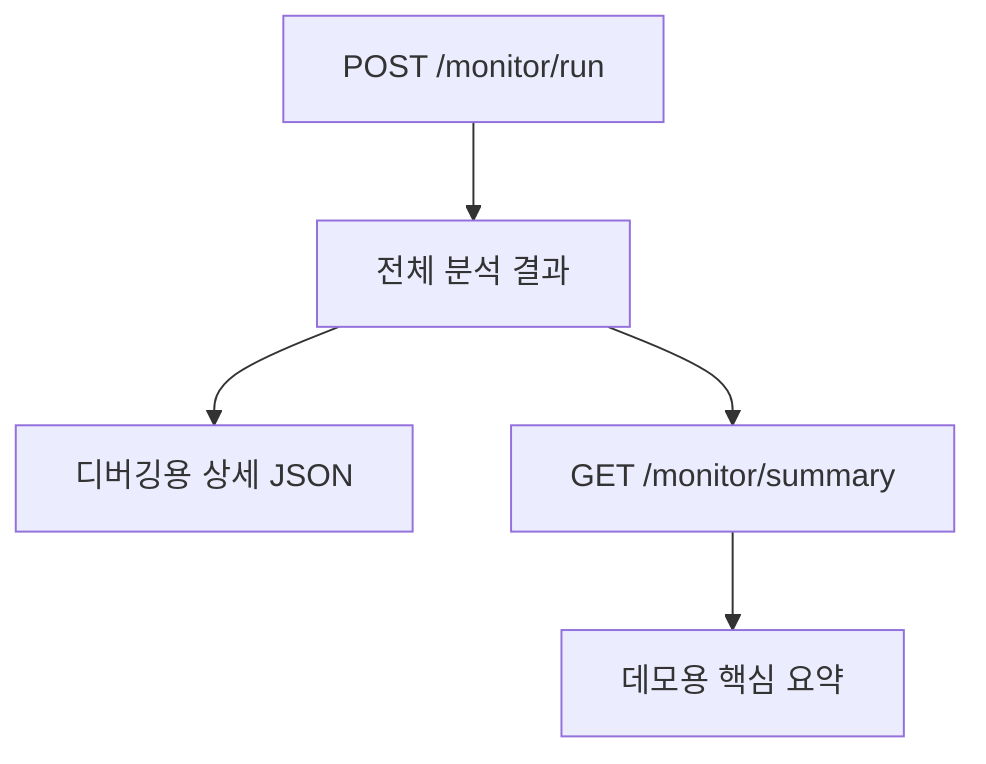
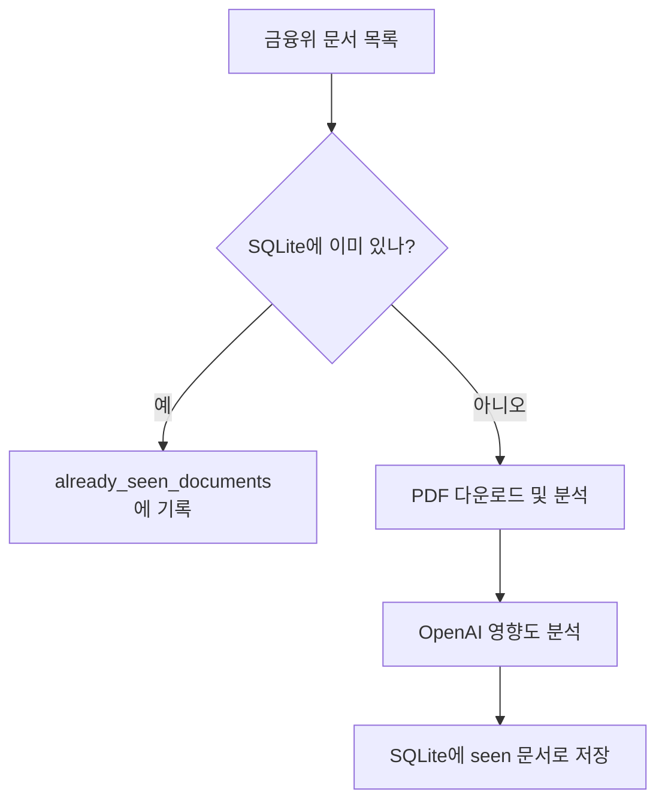

# 금융 규제 모니터링 AI 에이전트 만들기 6: 데모용 요약 API와 중복 감지

## 왜 요약 API가 필요했나

`POST /monitor/run`은 디버깅에는 좋다. 금융위 원문 URL, 첨부 PDF URL, 매칭된 회사 준수 항목, OpenAI 분석 결과, evidence_chunks까지 모두 볼 수 있기 때문이다.

하지만 면접이나 블로그 데모에서는 JSON이 너무 길어 핵심이 흐려진다. 그래서 별도 요약 API를 추가했다.

```text
GET /monitor/summary
```

이 API는 긴 결과 중 발표에 필요한 필드만 보여준다.

```text
- 문서 제목
- 등록일
- 영향도
- 담당 부서
- 영향 사유
- 권장 액션
- 알림 메시지
- 근거 조문
- 분석 방식
```

## 전체 결과와 요약 결과 분리



이렇게 분리하면 개발 중에는 상세 응답을 보고, 발표 중에는 요약 응답을 보여줄 수 있다.

## 왜 중복 감지가 필요했나

모니터링 시스템은 같은 문서를 매번 새 문서처럼 분석하면 안 된다. 이미 본 문서는 저장해두고, 다음 실행에서는 새 문서만 분석해야 한다.

이번 구현에서는 SQLite를 사용했다.

```text
storage/seen_documents.db
```

저장하는 값:

```text
- document_key
- title
- published_date
- detail_url
- source
- seen_at
```

문서 키는 우선 `detail_url`을 사용한다. URL이 없으면 출처, 등록일, 제목을 조합해 만든다.

## 동작 방식



기본 동작:

```bash
curl -s -X POST http://127.0.0.1:8000/monitor/run
```

이미 본 문서를 건너뛴다.

데모 중 이전 문서까지 다시 보고 싶을 때:

```bash
curl -s -X POST "http://127.0.0.1:8000/monitor/run?include_seen=true"
```

요약 API도 같은 옵션을 지원한다.

```bash
curl -s "http://127.0.0.1:8000/monitor/summary?include_seen=true"
```

## 이 단계의 고민

중복 감지를 넣으면 데모에서 두 번째 호출부터 결과가 비어 보일 수 있다. 하지만 실제 모니터링 시스템에서는 이 동작이 맞다. 그래서 기본값은 새 문서만 분석하도록 하고, 데모를 위해 `include_seen=true` 옵션을 열어두었다.

이 선택 덕분에 실제 시스템다운 동작과 반복 데모 편의성을 모두 가져갈 수 있었다.

